# Tab — AI Ajanları için Payment Channel Tabanlı Kredi Protokolü

> **Tek cümle:** Tab, AI ajanlarına Solana Payment Channels üzerinden *amaca bağlı* kredi açar: para sadece onaylı merchant'lara akabilir, harcanmayan kısım otomatik olarak LP'lere geri döner, temerrüt riski önce ajanın stake'inden karşılanır.
>
> **Hedef:** Colosseum Crypto World's Fair — Solana Track (+ genel havuz, Top 20, Accelerator)
> **Doküman tarihi:** 5 Ekim 2026 · **Durum:** Taslak v1 · **Çalışma adı:** Tab (alternatifler: Runway, Meterline, Overdraft — teslimden önce isim çakışması kontrol edilmeli)

---

## İçindekiler

1. [Hackathon Bilgileri ve Linkler](#1-hackathon-bilgileri-ve-linkler)
2. [Geçmiş Kazanan Analizi](#2-geçmiş-kazanan-analizi)
3. [Problem](#3-problem)
4. [Çözüm: Tab](#4-çözüm-tab)
5. [Puanlama (v1) ve Zayıf Yönler](#5-puanlama-v1-ve-zayıf-yönler)
6. [Zayıf Yönleri Geliştirme Önerileri](#6-zayıf-yönleri-geliştirme-önerileri)
7. [Mimari](#7-mimari)
8. [Akışlar (Flows)](#8-akışlar-flows)
9. [Program Tasarımı: Hesaplar ve Instruction'lar](#9-program-tasarımı-hesaplar-ve-instructionlar)
10. [Risk Motoru ve Parametreler](#10-risk-motoru-ve-parametreler)
11. [Ekonomi ve Gelir Modeli](#11-ekonomi-ve-gelir-modeli)
12. [Rakip Analizi ve Farklılaşma](#12-rakip-analizi-ve-farklılaşma)
13. [MVP Kapsamı](#13-mvp-kapsamı)
14. [7 Günlük Plan ve Görev Dağılımı](#14-7-günlük-plan-ve-görev-dağılımı)
15. [Demo Senaryosu](#15-demo-senaryosu)
16. [Pitch Video Senaryosu (< 3 dk)](#16-pitch-video-senaryosu--3-dk)
17. [Jüri Soru-Cevap Hazırlığı](#17-jüri-soru-cevap-hazırlığı)
18. [Riskler](#18-riskler)
19. [Teslim Kontrol Listesi](#19-teslim-kontrol-listesi)
20. [Kaynaklar](#20-kaynaklar)

---

## 1. Hackathon Bilgileri ve Linkler

### 1.1 Solana Mini Hacker House x 021Lab · Singapore 2026

| Alan | Detay |
|---|---|
| Link | https://luma.com/dpdxyo2d?tk=IOEi3d |
| Tarih | 5–6 Ekim 2026 |
| Yer | 67 Ayer Rajah Crescent, #05-08, Singapore 139950 |
| Organizatör | 021Lab · Co-host: Solar (Solana中文社群), articuler.ai, SMU Blockchain |
| Gün 1 (5 Ekim) | Tam gün build, takım kurma, mentor desteği |
| Gün 2 (6 Ekim) | AI Workshop + **Demo Day** (10:00–18:00), **5 dakikalık demo**, geri bildirim |
| Kapasite | ~50 builder |
| Destek | SafePal, AWS, QuickNode, Elfa AI, Orbit AI (cloud/credit) |
| Kayıt notu | World's Fair kaydında **Track: Solana**, **Region: Hong Kong** seçilmeli |
| Ek ödüller | Solar Ecosystem Contribution Awards (8 × $1K), KAST Real-World Utility Award ($250) |

### 1.2 Colosseum Crypto World's Fair (ana yarışma)

| Alan | Detay |
|---|---|
| Ana sayfa | https://colosseum.com/worldsfair |
| Arena / platform | https://colosseum.com/arena/hackathon |
| Tarih | 14 Eylül – 12 Ekim 2026 |
| **Son teslim** | ⚠️ Kaynaklar farklı: Colosseum "12 Ekim", Brezilya wiki "12 Ekim 23:59 BRT" (= 13 Ekim 10:59 SGT), Luma "13 Ekim 15:00 HKT". **Hedef: 12 Ekim akşamı SGT. Kesin saati platformdan teyit et.** |
| Toplam | $840K ödül + $2.5M seed fon |
| Grand Prize | $30.000 |
| Top 20 | 20 × $15.000 |
| Özel | Public Good $5K, University $5K |
| Solana Track | $100K → 10 × $10.000 |
| Diğer track'ler | Ethereum, Hyperliquid, Base, Tempo, Arbitrum, Zcash, Robinhood Chain |
| Accelerator | Seçilen takımlara $250K pre-seed, 12 hafta San Francisco |
| Format | Online, ücretsiz. Tüm projeler zincirden bağımsız genel havuzda ürün kalitesine göre değerlendirilir |

### 1.3 Jüri neye bakıyor? (Colosseum "How to Win" rehberinden)

- Tam zamanlı startup kurmaya niyetli takımlar, **uygulanabilir iş modeli**
- Ortalama kazanan takım **3+ kişi**, teknik + teknik olmayan kurucu karışımı
- "Wildly ambitious" ürün vizyonu, founder-market fit
- **Video < 3 dakika:** ekip, ürün, problem, pazar, ilk kullanıcıyı nasıl kazanacağınız, çalışan demo
- Devnet'te **"aha moment"** yaşatan demo
- Kaçın: tek kişilik başvuru, niş ürün, stealth, cilasız sunum

### 1.4 Faydalı Araç ve Dokümanlar

| Kaynak | Link |
|---|---|
| How to Win a Colosseum Hackathon | https://blog.colosseum.com/how-to-win-a-colosseum-hackathon/ |
| Colosseum Copilot (fikri 8.000+ başvuruya karşı kontrol) | https://colosseum.com (Copilot) |
| Solana Payment Channels (duyuru) | https://solana.com/news/payment-channels-1-million-payments-per-second |
| Payment Channels sayfası | https://solana.com/payment-channels |
| Program repo (Pinocchio, MIT, mainnet) | https://github.com/solana-foundation/payment-channels |
| pay-kit (SDK + playground) | https://github.com/solana-foundation/pay-kit |
| pay (toolchain) | https://github.com/solana-foundation/pay |
| Konsept dokümanı | https://pay.sh/docs/building-with-pay/payment-channels/concept |
| Teknik spec (session intent) | https://paymentauth.org/draft-solana-session-00.html |
| High-throughput proxy şablonu | https://solana.com/developers/templates/pay-high-throughput-proxy |
| Program ID (mainnet) | `CHNLxYvVA28MJP9PrFuDXccuoGXAx7jBacfLEkahyGsX` |
| Kamino (idle yield) | https://kamino.finance |

---

## 2. Geçmiş Kazanan Analizi

### 2.1 Agent ödemeleri — her hackathonda kazanıyor ama artık doymuş

| Hackathon | Proje | Ne yapıyor |
|---|---|---|
| Breakout (AI track) | **Latinum** | MCP builder'ların para kazanması için ödeme middleware'i |
| Cypherpunk (Stablecoin 1.) | **MCPay** | MCP + x402 açık ödeme altyapısı |
| Cypherpunk (Stablecoin) | **Mercantill** | AI ajanlar için kurumsal bankacılık altyapısı |
| Cypherpunk (Infra) | **Corbits** | Açık kaynak x402 endpoint dashboard |
| Frontier | **Flovia** | Makine-ödemeli API kullanım analitiği |
| Frontier | **Clawpump** | Agentic finance (swap, snipe, lending otomasyonu) |
| Frontier | **Peaks** | AI ajan destekli yatırım uygulaması |

**Ders:** "Ajan x402 ile ödeme yapıyor" tek başına artık yenilik değil. Bir **finansal katman** eklemek gerekiyor.

### 2.2 Kredi / underwriting / yield — DeFi'de kazanıyor

| Hackathon | Proje | Ne yapıyor |
|---|---|---|
| Cypherpunk (DeFi 1.) | **Yumi Finance** | Underwriting'den kredi açılışına BNPL |
| Cypherpunk (DeFi) | **Hobba** | Kendi kendini geri ödeyen kredilerle ödeme |
| Cypherpunk (DeFi) | **Kormos** | Fractional reserve ile yield üretimi |
| Cypherpunk (Undefined 1.) | **attn.markets** | İşletme gelirlerini tokenize etme |
| Cypherpunk (RWA) | **Legasi** | Lombard kredileriyle uyumlu kredi katmanı |
| Frontier | **YieldCompass**, **Housd**, **KinnectFi**, **Stablecorp**, **DashX** | Yield arama, RE yield, neobank, stablecoin altyapı, cross-border |
| Breakout (DeFi) | **Paystream** | P2P DeFi lending |

**Ders:** Gerçek nakit akışına dayalı kredi + net iş modeli jürinin en sevdiği DeFi kalıbı.

### 2.3 Dışarıdan sinyal

- **Advance** (Base) — Runtime Agent Week NY, Eylül 2026'da **iki track'te 1.** Ajanın zincir üstü ücret gelirine dayalı kredi, Uniswap CCA ile kredi notu satışı, politika bağlı kart.
- → Tema jüriler tarafından ödüllendiriliyor. **Ama** Solana'da kanal-yerel versiyonu yok. Farkımızı 10 saniyede anlatabilmeliyiz (bkz. §12).

### 2.4 Frontier istatistikleri

- 2.857 başvuru, 10.000+ katılımcı, 150 ülke → rekabet çok yüksek, cila ve netlik belirleyici.
- 25 kazananın 8'i DeFi/finans; trendler: agentic AI, stablecoin ödemeleri, prediction markets, RWA.

---

## 3. Problem

### 3.1 Ajan ödemeleri hızla büyüyor

- Solana, x402 işlemlerinin **~%76'sını** işliyor (4 haftada 23,2M işlem).
- x402 Foundation (Linux Foundation, Temmuz 2026): Visa, Stripe, Google, AWS dahil 17 premier üye.
- **4 Eylül 2026:** Solana Foundation **Payment Channels**'ı yayınladı. Ajan bir tavanı escrow'a kilitliyor, off-chain imzalı voucher'larla harcıyor, tek işlemde settle ediyor. x402 `upto`, x402 batch-settlement ve MPP session uyumlu. İlk partner: Alibaba Cloud.

### 3.2 Ama sermaye problemi var

1. **Sermaye kilitleniyor.** "Capital gets locked for the life of the channel." Ajan her merchant için ayrı bir tavan kilitlemek zorunda. 10 API sağlayıcısı = 10 ayrı kilitli bakiye.
2. **Ön fonlama zorunlu.** Ajan (veya operatörü) harcamadan önce nakit bulmak zorunda. Ajanın geliri sonra geliyor, gideri önce.
3. **Kilitli paraya yield yok, kredi yok.** Spec ve dokümanlarda yield, kredi veya teminat mekanizması yok.
4. **Mevcut ajan kredileri riskli.** Ajana nakit verilirse (Advance, Fianza), para her yere gidebilir; prompt injection veya kötü niyetli operatör parayı çekebilir.

### 3.3 Kimin problemi?

- **Ajan operatörleri / AI app geliştiricileri:** inference, veri, compute için sürekli ödeme yapıyorlar; working capital sıkışık.
- **Merchant'lar (API/inference sağlayıcıları):** daha fazla ödeyen ajan istiyorlar ama kredi riski almak istemiyorlar.
- **LP'ler:** stablecoin'leri için gerçek ekonomik aktiviteye bağlı, ponzi olmayan yield arıyorlar.

---

## 4. Çözüm: Tab

### 4.1 Anahtar içgörü (spec'ten doğrulandı)

Payment Channel hesabında iki ayrı rol var:

| Alan | Anlamı | Tab'de kim? |
|---|---|---|
| `payer` | Depozitoyu yatıran, **iade alan** | **Tab havuz PDA'sı** |
| `authorizedSigner` | Voucher imzalayan | **Ajanın anahtarı** |
| `payee` | Ödemeyi alan | Onaylı merchant |

Kapanışta `distribute`, harcanmayan kısmı (`deposit - settled`) **payer'a** gönderir. Payer `requestClose` ile kanalı zorla kapatabilir ve `withdraw_payer` ile kalan parayı geri alabilir.

**Sonuç:**
- Ajan krediyi **nakde çeviremez**, sadece kanalın payee'sine harcayabilir.
- Harcanmayan para **otomatik LP havuzuna döner**.
- Havuz payer olduğu için, kötü davranan ajanın kanalını **anında kapatabilir**.
- Risk = tavan değil, **tüketilmiş ama geri ödenmemiş tutar**.

### 4.2 Üç bileşen

| Bileşen | Nasıl |
|---|---|
| **Payment** | Ajan sıfır bakiyeyle onaylı API'lere ödeme yapar; merchant tam fonlu kanal sayesinde garantili ödeme alır |
| **Stake** | Junior tranche: ajan operatörünün bond'u + ajanı destekleyen backer'lar (ilk kayıp). Merchant bond: işbirliği saldırısına karşı |
| **Yield** | Senior LP'ler USDC yatırır. Boştaki sermaye Kamino'da baz faiz + ajanların ödediği kredi ücreti + merchant ücreti |

### 4.3 Slogan alternatifleri

- "Your agent runs a tab. LPs earn the yield."
- "Credit that can't be stolen — only spent."
- "Advance gives agents cash. Tab gives agents a tab."

---

## 5. Puanlama (v1) ve Zayıf Yönler

| Kriter | v1 Puan | Gerekçe |
|---|---|---|
| Yenilik | 8.5 | Payment Channels bir aylık; kanal-yerel amaca bağlı kredi yapan yok |
| Solana ekosistem uyumu | 9 | Solana Foundation'ın en çok öne çıkardığı yeni primitive üzerine |
| Teknik derinlik | 8 | CPI, tranche, slash, keeper — ciddi DeFi tasarımı |
| İş modeli | 7 | Spread net ama lending ölçeklenene kadar düşük gelir |
| **Pazar** | **5.5** | Gerçek ajan ödeme hacmi küçük; Artemis'e göre x402 işlemlerinin ~%50'si yapay |
| **7 günde demo** | **6.5** | Yapılabilir ama sıkışık; pay-kit/CPI entegrasyonunda takılma riski |
| **Farklılaşma** | **7** | Advance ile karıştırılma riski |
| **Genel** | **7.5 / 10** | |

**Zayıf yönler (öncelik sırasıyla):**

1. Pazar büyüklüğü ve talep kanıtı
2. Demo teslim riski
3. Advance / Fianza / Tokenline'dan ayrışmanın anlatımı
4. İş modelinin tek gelir kalemine dayanması
5. Underwriting cold-start (geçmişi olmayan ajan)
6. Dolandırıcılık vektörleri (işbirliği, sybil, voucher görünmezliği)
7. Regülasyon algısı
8. Ekip yapısı

---

## 6. Zayıf Yönleri Geliştirme Önerileri

### 6.1 Pazar (5.5 → 7.5)

**Sorun:** Jüri "Kim kullanacak, hacim gerçek mi?" diye soracak.

**Öneriler:**

1. **Kama (wedge) pazarını daralt: inference harcaması.** Kripto-ajan ticareti değil, *AI şirketlerinin zaten ödediği* inference/compute faturası. Alibaba Cloud pay.sh'te canlı. Pitch: "Her AI app LLM faturası ödüyor; biz bunu net-7 ödeme vadesine çeviriyoruz."
2. **Merchant tarafından talep yarat (BNPL modeli).** Klarna'nın modeli: merchant ödeme ücreti öder çünkü dönüşüm artar. API sağlayıcısı, "Tab kabul ediyoruz" diyerek ön fonlaması olmayan ajanları müşteri yapar. → Merchant artık kullanıcı da.
3. **Talep kanıtı topla (bu hafta).**
   - Hacker house'taki ~50 builder'a 2 soruluk anket: "Ajanınız API'lere ödeme yapıyor mu? Ön fonlama sorun mu?"
   - En az **2 LOI / yazılı niyet** (bir merchant + bir ajan operatörü). Bir tweet veya Telegram mesajının ekran görüntüsü bile işe yarar.
   - Bir waitlist sayfası + kayıt sayısı.
4. **Dürüst sayılar kullan.** Şişirilmiş "$31B" yerine doğrulanmış metrikleri göster, sonra büyüme trendini (Payment Channels, x402 Foundation, Ramp, AWS) anlat. Jüri dürüstlüğü ödüllendirir.

### 6.2 Demo riski (6.5 → 8)

1. **Önce yerel ortam.** `solana-test-validator --clone-upgradeable-program CHNLxYvVA28MJP9PrFuDXccuoGXAx7jBacfLEkahyGsX --url mainnet-beta` ile mainnet programını yerel validator'a klonla (veya Surfpool kullan). Devnet'te program olup olmadığına bağımlı kalma. Gerekirse MIT lisanslı programı kendi devnet'imize deploy et.
2. **Raw CPI.** Program Pinocchio ile yazılmış, Anchor IDL'i olmayabilir. Instruction layout'unu repo'dan çıkar, `invoke_signed` ile manuel CPI yaz. **Gün 1'in ilk işi bu spike olmalı.**
3. **Plan B.** CPI 2. günün sonunda çalışmazsa: aynı arayüzü taklit eden minimal bir "channel-mock" programı yaz, pitch'te "mainnet programına CPI v1.1'de" de. Demo yine de akıcı olur.
4. **Kapsamı dondur.** Demo için 4 adım kusursuz çalışsın: kanal açma → kullanım/settle → iadenin havuza dönmesi → geri ödeme / slash. Geri kalan her şey v2.
5. **Mainnet'te tek gerçek işlem.** Son gün $1'lık gerçek bir kanal aç-kapat; Solscan linkini videoya koy.

### 6.3 Farklılaşma (7 → 9)

- **10 saniyelik cümle:** "Advance ajanlara nakit veriyor. Tab ajanlara hesap açıyor: para sadece merchant'a akabilir ve harcanmazsa LP'ye geri döner."
- Pitch'te §12'deki karşılaştırma tablosunu tek slayt olarak göster.
- **"Çalınamaz kredi"** mesajını prompt injection örneğiyle anlat: Ajan ele geçirilse bile saldırgan parayı kendi cüzdanına çekemez.

### 6.4 İş modeli (7 → 8)

Tek gelir kalemi yerine dört kalem (detay §11):

1. Ajan kredi ücreti (risk bazlı fiyatlama)
2. Merchant ücreti (MDR, BNPL modeli)
3. Protokol payı (LP yield'inden)
4. **Kredi skoru API'si** — ajanların Tab skorunu x402 ile ücretli sorgulama (diğer protokoller, merchant'lar kullanır)

### 6.5 Underwriting cold-start

- **Faz 0 (MVP):** Limit = bond × çarpan (yeni ajan için 1.0x → tamamen teminatlı ama yine de *sermaye verimli*: tek bond, N kanal).
- **Faz 1:** Zincir üstü geçmiş: Tab üzerindeki zamanında geri ödemeler, kanal settle geçmişi, geçmiş x402 ödemeleri → çarpan 3.0x'e kadar.
- **Faz 2:** Backer stake'i (sosyal underwriting), KYB'li operatörlere yüksek limit, attestation'lar (ör. Solana Attestation Service).

**Önemli not:** 1.0x çarpan bile değer üretir: Ajan 10 merchant için 10 ayrı tavan kilitlemek yerine tek bir bond yatırır, havuz kanalları küçük artımlarla fonlar.

### 6.6 Dolandırıcılık vektörleri

| Saldırı | Açıklama | Önlem |
|---|---|---|
| **Ajan–merchant işbirliği** | Ajan kendi kontrolündeki sahte merchant'a kanal açıp havuzu boşaltır | Sadece **allowlist + bond'lu** merchant'lar. Merchant başına maruziyet tavanı. Kanıtlanan işbirliğinde merchant bond'u slash |
| **Sybil ajanlar** | Çok sayıda yeni ajanla küçük limitler toplamak | Yeni ajan çarpanı 1.0x (tamamen teminatlı). Limit stake'le orantılı |
| **Voucher görünmezliği** | Off-chain voucher'lar settle edilene kadar havuz tüketimi göremez | Küçük tavanlar + revolving top-up. Merchant'lar için settle SLA'sı (watermark > %50 veya X saatte bir). Maks. risk = açık borç + 1 artım |
| **Geri ödemeden kaçma** | Ajan borcu ödemez | Vade + grace sonrası havuz `requestClose` ile tüm kanalları keser, waterfall ile slash |
| **Prompt injection** | Ajan ele geçirilir | Para sadece allowlist payee'lere gidebilir, nakde çevrilemez. Operatör ajan başına günlük limit koyar |

### 6.7 Regülasyon algısı

- MVP: B2B / ajan operatörü kredisi olarak konumlandır; tüketici kredisi değil.
- Yüksek limitler için opsiyonel KYB katmanı.
- Pitch'te bir cümle: "Uyum katmanını büyük limitler için KYB'li operatörlerle başlatıyoruz." (Bu hukuki tavsiye değildir; büyümeden önce hukuki görüş alınmalı.)

### 6.8 Ekip

- Video'da her üyenin rolünü ve geçmişini 1 cümleyle göster.
- Bir kişi açıkça **BD/ürün** rolünü üstlensin (merchant/LOI toplama, pitch).
- "Hackathon sonrası tam zamanlı devam ediyoruz" mesajı açıkça verilmeli.

### 6.9 Geliştirmeler sonrası hedef puan

| Kriter | v1 | Hedef v2 | Ne değişir |
|---|---|---|---|
| Yenilik | 8.5 | 8.5 | — |
| Ekosistem uyumu | 9 | 9.5 | Mainnet program CPI + gerçek işlem |
| Teknik derinlik | 8 | 8.5 | Revolving top-up, waterfall, raw CPI |
| İş modeli | 7 | 8 | 4 gelir kalemi, merchant tarafı |
| Pazar | 5.5 | 7.5 | Inference wedge + LOI'ler + dürüst metrikler |
| Demo | 6.5 | 8 | Yerel klon + Plan B + kapsam dondurma |
| Farklılaşma | 7 | 9 | 10 saniyelik cümle + karşılaştırma slaytı |
| **Genel** | **7.5** | **~8.5** | |

---

## 7. Mimari

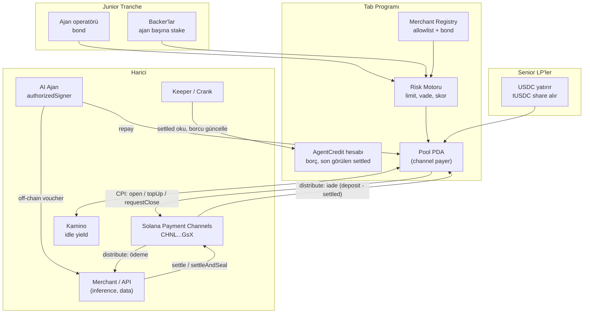

### 7.1 Teknoloji yığını

| Katman | Seçim |
|---|---|
| Zincir program | Rust, **Anchor** (Tab programı) + raw `invoke_signed` CPI → Pinocchio Payment Channels programı |
| Token | USDC (SPL); Token-2022 de destekleniyor |
| SDK / ödeme | `pay-kit` (voucher imzalama, x402 `upto` / MPP session) |
| Ajan | Claude / OpenAI + Solana Agent Kit veya basit TS ajan; ajan anahtarı = `authorizedSigner` |
| Mock merchant | Node/Express paralı API (inference proxy) — pay-kit high-throughput proxy şablonu |
| Keeper | TS servis (cron): settle takibi, top-up, vade kontrolü, default işaretleme |
| Frontend | Next.js + wallet-adapter; LP dashboard, ajan dashboard, merchant görünümü |
| Yerel ağ | `solana-test-validator --clone-upgradeable-program ...` veya Surfpool |
| Idle yield | MVP'de simüle; v2'de Kamino CPI |

---

## 8. Akışlar (Flows)

### 8.1 LP Yatırma / Çekme

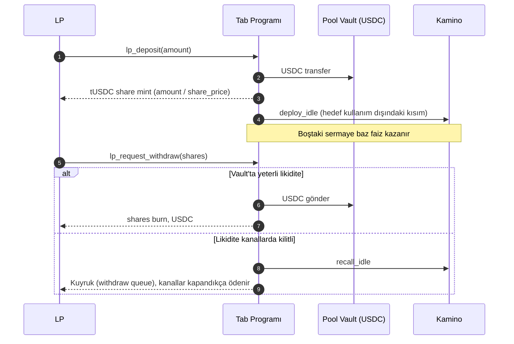

### 8.2 Ajan Onboarding ve Stake

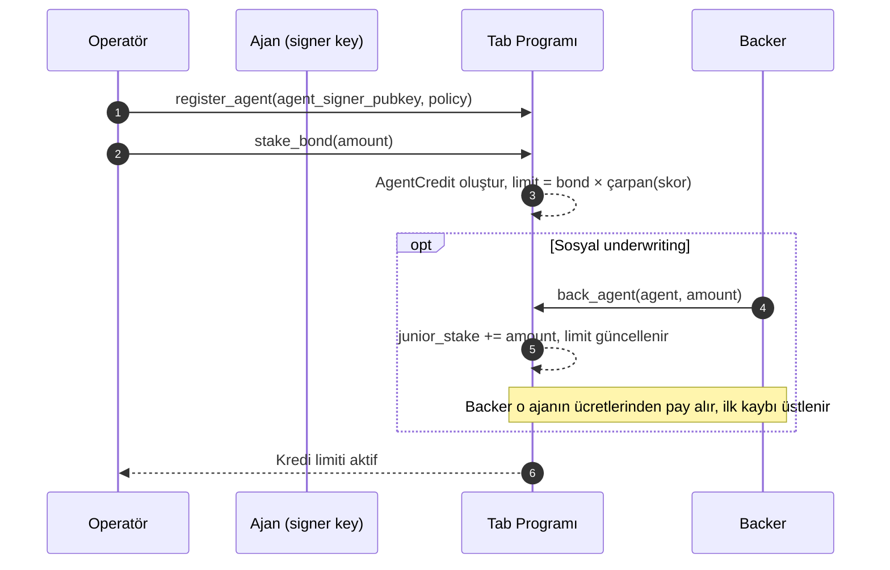

### 8.3 Merchant Onboarding

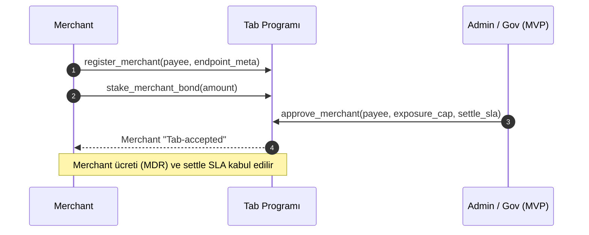

### 8.4 Kredili Kanal Açma (çekirdek akış)

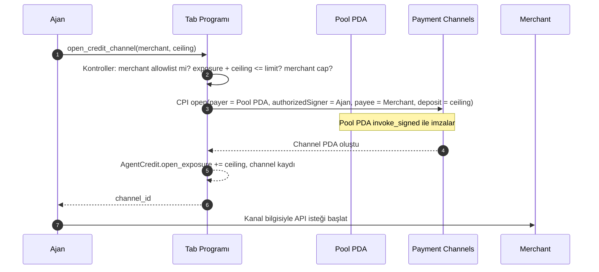

### 8.5 Kullanım, Settle ve İade

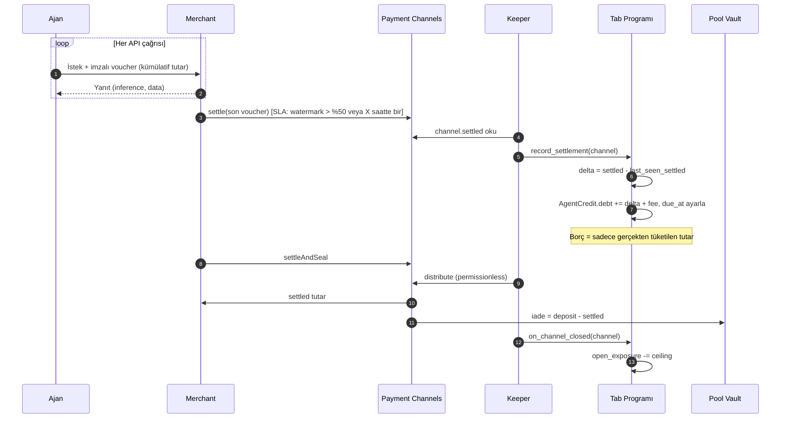

### 8.6 Geri Ödeme ve Revolving Top-up

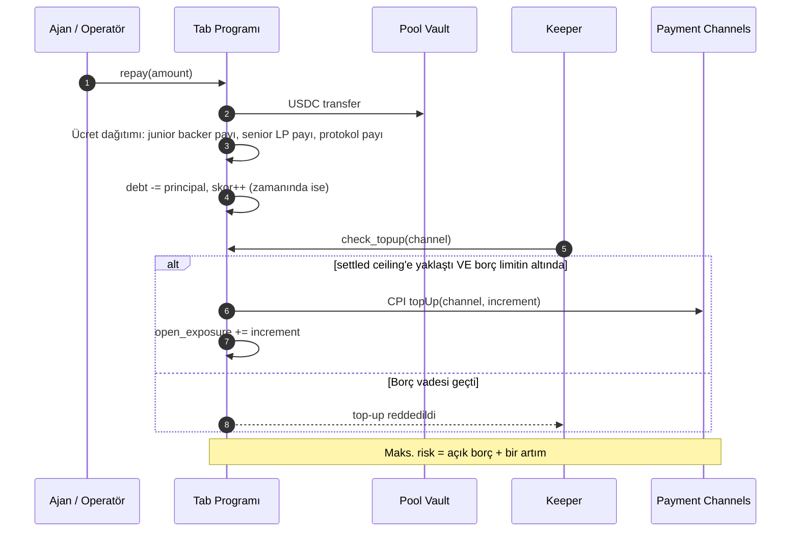

### 8.7 Temerrüt ve Slash Waterfall

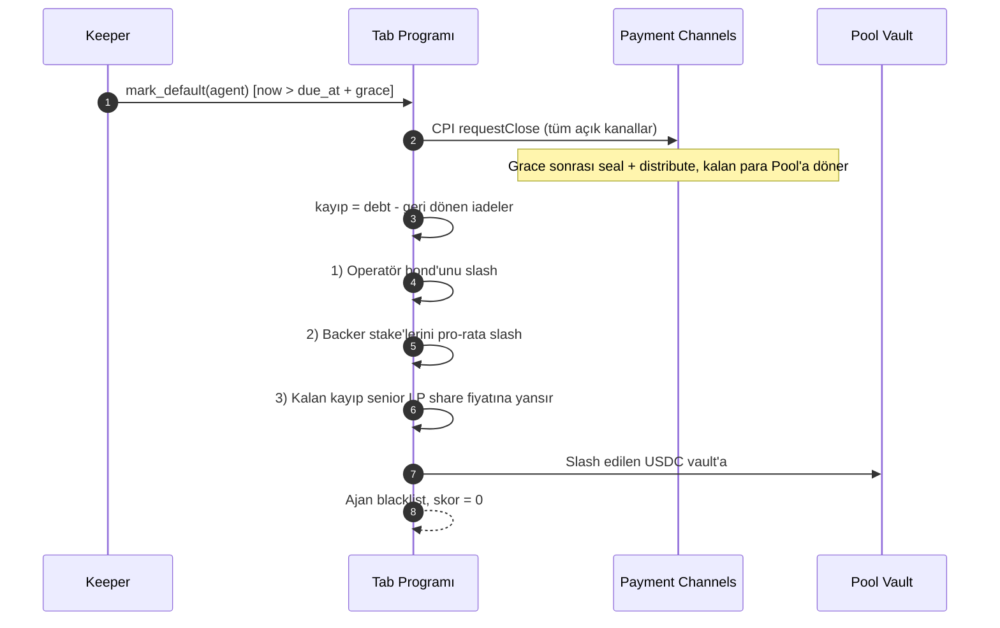

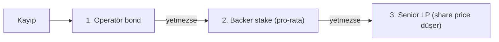

### 8.8 İşbirliği Saldırısı ve Merchant Slash

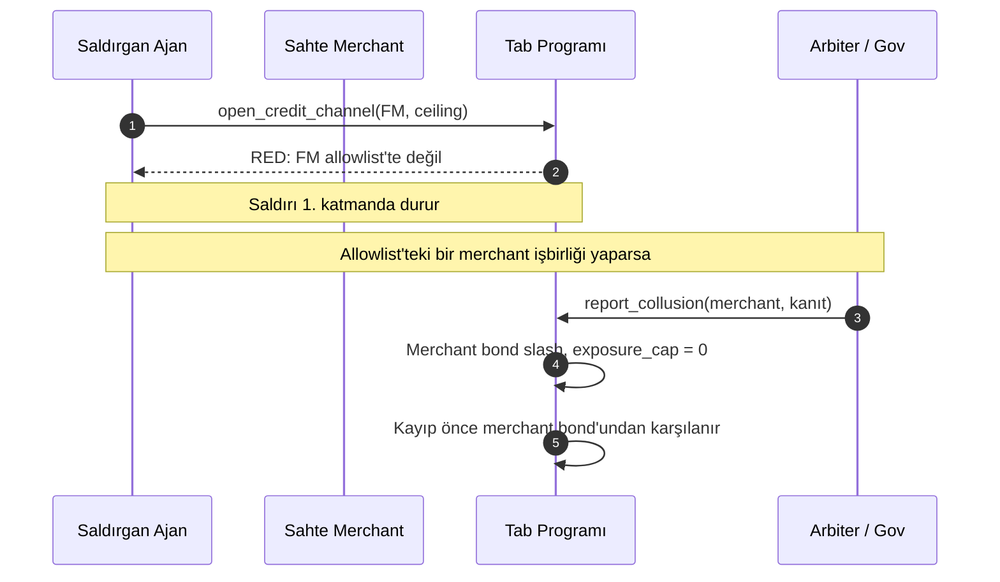

### 8.9 Uçtan Uca Kullanıcı Yolculuğu

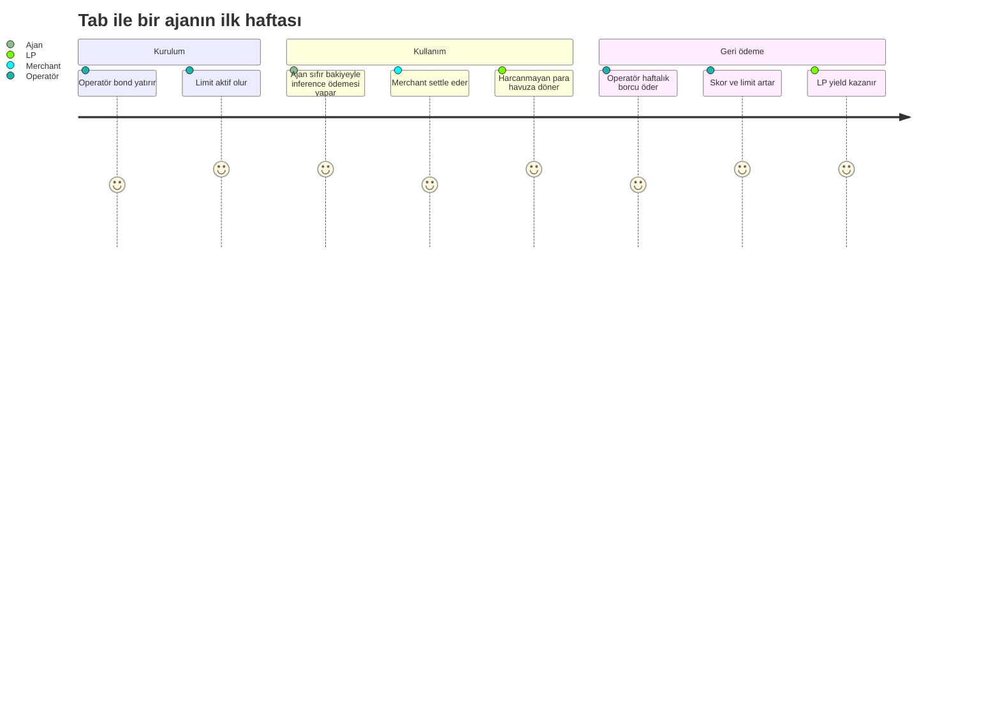

---

## 9. Program Tasarımı: Hesaplar ve Instruction'lar

### 9.1 Hesaplar

```rust
// Global havuz
pub struct Pool {
    pub authority: Pubkey,
    pub usdc_mint: Pubkey,
    pub vault: Pubkey,            // Pool PDA'nın USDC ATA'sı
    pub share_mint: Pubkey,       // tUSDC
    pub total_assets: u64,        // vault + kanallardaki + Kamino'daki
    pub total_borrowed: u64,      // tüm ajanların açık borcu
    pub total_open_exposure: u64, // kanallardaki toplam deposit
    pub protocol_fee_bps: u16,
    pub senior_share_bps: u16,
    pub junior_share_bps: u16,
    pub bump: u8,
}

pub struct AgentCredit {
    pub operator: Pubkey,
    pub agent_signer: Pubkey,     // channel authorizedSigner
    pub bond: u64,
    pub backer_stake: u64,
    pub multiplier_bps: u16,      // 10000 = 1.0x
    pub score: u16,               // 0-1000
    pub debt: u64,                // tüketilmiş + ücret, ödenmemiş
    pub open_exposure: u64,       // açık kanalların deposit toplamı
    pub due_at: i64,
    pub status: AgentStatus,      // Active | Frozen | Defaulted
    pub daily_limit: u64,         // operatör politikası
}

pub struct BackerPosition {
    pub backer: Pubkey,
    pub agent: Pubkey,
    pub amount: u64,
    pub unlock_at: i64,           // cooldown
    pub fees_accrued: u64,
}

pub struct Merchant {
    pub payee: Pubkey,
    pub bond: u64,
    pub exposure_cap: u64,
    pub current_exposure: u64,
    pub mdr_bps: u16,
    pub settle_sla_secs: i64,
    pub status: MerchantStatus,   // Pending | Approved | Slashed
}

pub struct CreditChannel {
    pub channel: Pubkey,          // Payment Channels PDA
    pub agent: Pubkey,
    pub merchant: Pubkey,
    pub deposit: u64,
    pub last_seen_settled: u64,
    pub open: bool,
}
```

### 9.2 Instruction'lar

| Instruction | Kim çağırır | Ne yapar | MVP? |
|---|---|---|---|
| `initialize_pool` | Admin | Havuz, vault, share mint | ✅ |
| `lp_deposit` | LP | USDC → vault, share mint | ✅ |
| `lp_withdraw` | LP | Share burn → USDC (likiditeye göre kuyruk) | ✅ (kuyruksuz basit) |
| `register_agent` | Operatör | AgentCredit oluştur | ✅ |
| `stake_bond` / `unstake_bond` | Operatör | Bond yatır / çek (borç yoksa) | ✅ |
| `back_agent` / `unback_agent` | Backer | Junior stake, cooldown | ⏳ v2 |
| `register_merchant` / `approve_merchant` | Merchant / Admin | Allowlist + bond | ✅ (bond opsiyonel) |
| `open_credit_channel` | Ajan | Kontroller + CPI `open` | ✅ |
| `top_up_credit_channel` | Keeper | Kontroller + CPI `topUp` | ✅ |
| `record_settlement` | Keeper (permissionless) | Channel `settled` oku, borç güncelle | ✅ |
| `close_credit_channel` | Ajan / Keeper | CPI `requestClose` / iadeyi işle | ✅ |
| `repay` | Operatör / Ajan | Borç öde, ücret dağıt | ✅ |
| `mark_default` | Keeper | Kanalları kapat, waterfall slash | ✅ |
| `report_collusion` / `slash_merchant` | Arbiter | Merchant bond slash | ⏳ v2 |
| `deploy_idle` / `recall_idle` | Keeper | Kamino CPI | ⏳ v2 (MVP'de simüle) |

### 9.3 CPI notları (Payment Channels programı)

- Program **Pinocchio** ile yazılmış; Anchor IDL olmayabilir → instruction discriminator ve hesap sırasını repo'dan çıkar, `solana_program::program::invoke_signed` ile çağır.
- Spec: `open` için **payer imzacı olmalı** → Pool PDA `invoke_signed` ile imzalar.
- `authorizedSigner` = ajanın Ed25519 anahtarı (geçerli curve noktası olmalı).
- `payee` PDA olabilir ("`open` does NOT curve-check `payee`").
- SOL rent'i `Channel.rentPayer`'a (operatör) döner; token iadesi payer'a.
- `topUp` sadece `status == Open` iken; `Closing` durumunda reddedilir.
- Native SOL desteklenmez; USDC kullan.
- Durum makinesi: `Open → Closing → Sealed → Distributed`, `gracePeriod` saniye cinsinden.

---

## 10. Risk Motoru ve Parametreler

### 10.1 Kredi limiti

```
limit = bond × multiplier(score) + backer_stake × 1.0
multiplier(score) = 1.0x (score < 200) … 3.0x (score ≥ 800), doğrusal
```

**Kısıtlar (open/topUp anında):**

```
agent.debt + agent.open_exposure + yeni_deposit ≤ limit
merchant.current_exposure + yeni_deposit ≤ merchant.exposure_cap
pool.total_open_exposure + yeni_deposit ≤ pool.total_assets × max_utilization
```

### 10.2 Skor girdileri (MVP: basit, v2: zengin)

| Girdi | Ağırlık (öneri) |
|---|---|
| Zamanında geri ödeme sayısı / oranı | %35 |
| Toplam geri ödenen hacim | %20 |
| Hesap yaşı | %10 |
| Merchant çeşitliliği | %10 |
| Bond + backer stake büyüklüğü | %15 |
| Geçmiş x402 / kanal settle aktivitesi (Tab dışı) | %10 |

### 10.3 Başlangıç parametreleri (örnek, ayarlanabilir)

| Parametre | Değer |
|---|---|
| Kanal artımı (ceiling increment) | $5 |
| Vade (`due_at`) | İlk tüketimden 7 gün |
| Grace | 48 saat |
| Max utilization | %80 |
| Yeni ajan çarpanı | 1.0x |
| Maks. çarpan | 3.0x |
| Merchant settle SLA | Watermark > %50 veya 6 saat |
| Backer cooldown | 7 gün |

---

## 11. Ekonomi ve Gelir Modeli

> ⚠️ Aşağıdaki rakamlar **örnek / varsayımsal**dır, APY vaadi değildir.

### 11.1 Gelir kalemleri

| Kalem | Kim öder | Örnek |
|---|---|---|
| Kredi ücreti | Ajan operatörü | Tüketilen tutarın %1'i (7 günlük vade) |
| Merchant ücreti (MDR) | Merchant | Tab ile gelen hacmin %1.5'i |
| Baz yield | Kamino | Boştaki sermaye üzerinde değişken faiz |
| Kredi skoru API | Üçüncü taraflar | Sorgu başına x402 ile mikro ödeme |

### 11.2 Ücret dağılımı (örnek)

| Alıcı | Pay |
|---|---|
| Senior LP | %60 |
| Junior (operatör bond + backer'lar) | %30 |
| Protokol hazinesi | %10 |

### 11.3 Basit örnek

- Havuz: $100.000 senior LP
- Ayda $200.000 ajan tüketimi (revolving, ortalama 7 gün vade)
- Kredi ücreti %1 → $2.000; MDR %1.5 → $3.000; toplam $5.000/ay
- Senior LP'ye %60 → $3.000/ay ≈ %36 yıllık (+ Kamino baz faizi) — **kayıplar hariç, iyimser senaryo**
- Gerçekçi pitch: "LP yield'i ajan ticaretinin hacmiyle ölçeklenir; kayıplar önce junior tranche'tan karşılanır."

---

## 12. Rakip Analizi ve Farklılaşma

| Proje | Zincir | Mekanizma | Kredi nereye gider? | Harcanmayan para | Stake/tranche | Tab'den farkı |
|---|---|---|---|---|---|---|
| **Advance** | Base | Gelir bazlı kredi, Uniswap CCA ile not satışı, politika bağlı kart | Kart (geniş) | Ajanda kalır | Yok (not alıcıları) | Tab: kanal-yerel, para sadece payee'ye, iade otomatik LP'ye |
| **Fianza (TrustLine)** | Stellar | Gelirden teminatsız kredi, ajan başına izole vault | Ajan | Ajanda | Yok | Tab: Solana, amaca bağlı, junior tranche |
| **Tokenline** | Solana | Memecoin creator fee'lerinden pay-later compute, tek sağlayıcı | Tek merchant (UsePod) | — | Token teminatı | Tab: açık havuz, çok merchant, resmi primitive, permissionless LP |
| **x402r** | Base | Escrow + iade + arbiter | — | — | Yok | Kredi değil, iade protokolü |
| **yield.xyz AgentKit, MoonPay PayBox + Kamino** | Çok zincir / Solana | Ajanların yield'e erişimi | — | — | — | Kredi yok; Tab LP tarafında bunları kullanabilir |
| **Solana Payment Channels** | Solana | Escrow + voucher + batch settle | Payee | Payer'a döner | Yok | Tab bunun üzerine kredi + stake + yield katmanı |

**Tek slayt mesajı:**

> Advance gives agents **cash**. Tab gives agents a **tab**.
> Para sadece merchant'a akabilir · harcanmayan para LP'ye döner · ajan ele geçirilse bile kredi çalınamaz.

---

## 13. MVP Kapsamı

### ✅ Yapılacak (demo için şart)

- [ ] Tab Anchor programı: `Pool`, `AgentCredit`, `Merchant`, `CreditChannel`
- [ ] LP deposit/withdraw (basit)
- [ ] Ajan register + bond
- [ ] Merchant allowlist (admin onaylı)
- [ ] `open_credit_channel` → Payment Channels CPI (Pool PDA payer)
- [ ] `record_settlement` + borç muhasebesi
- [ ] İadenin havuza dönmesi (`distribute`)
- [ ] `repay` + ücret dağıtımı (senior/junior/protokol)
- [ ] `top_up_credit_channel` (keeper)
- [ ] `mark_default` + bond slash waterfall
- [ ] Mock merchant: paralı inference proxy (pay-kit)
- [ ] Demo ajanı (Claude/LLM) — sıfır bakiye, Tab kanalıyla ödeme
- [ ] Dashboard: LP görünümü, ajan hesabı, kanal durumu, olay akışı

### ⏳ v2 (pitch'te "roadmap" olarak)

- Backer stake / sosyal underwriting
- Merchant bond slash + arbiter
- Kamino idle yield CPI
- Kredi skoru API (x402)
- Withdraw kuyruğu, risk bazlı fiyatlama
- KYB katmanı, attestation entegrasyonu
- Ajan geliri üzerinden otomatik geri ödeme (ajan kendisi de merchant ise)

### ❌ Yapılmayacak

- Token / tokenomik
- Çok zincir
- Tüketici uygulaması

---

## 14. 7 Günlük Plan ve Görev Dağılımı

### 14.1 Roller (önerilen, 3–4 kişi)

| Rol | Sorumluluk |
|---|---|
| **Smart contract** | Anchor programı, CPI, testler |
| **Full-stack (Ege)** | Dashboard, keeper servisi, pay-kit entegrasyonu, mock merchant |
| **Ajan / entegrasyon** | Demo ajanı, voucher akışı, uçtan uca test |
| **Ürün / BD / pitch** | LOI, anket, waitlist, video, slaytlar, jüri Q&A |

### 14.2 Takvim

| Gün | Tarih | Hedef | Çıktı |
|---|---|---|---|
| 1 | 5 Ekim (Pzt) | **CPI spike** (Pool PDA ile kanal açma, yerel klon). Repo iskeleti. Pitch v0 | Çalışan `open` CPI veya Plan B kararı |
| 2 | 6 Ekim (Sal) | **Demo Day:** 5 dk sunum (slayt + kaba akış). Mentor/jüri geri bildirimi. Anket + LOI toplama | Geri bildirim notları, ilk LOI'ler |
| 3 | 7 Ekim (Çar) | `record_settlement`, borç muhasebesi, `repay`, ücret dağıtımı. Mock merchant | Uçtan uca: aç → kullan → settle → öde |
| 4 | 8 Ekim (Per) | `top_up` keeper, `mark_default` + slash. Testler | Risk akışları çalışıyor |
| 5 | 9 Ekim (Cum) | Dashboard (LP, ajan, kanal, olay akışı). Demo ajanı (LLM) | Görsel demo |
| 6 | 10 Ekim (Cmt) | Cila, hata düzeltme, mainnet'te $1'lık gerçek kanal işlemi. Video çekimi | Video taslağı |
| 7 | 11 Ekim (Paz) | Video final, README, slaytlar, Copilot ile benzerlik kontrolü | Teslim paketi |
| — | 12 Ekim (Pzt) | **Teslim** (akşam SGT'den önce) + yedek zaman | ✅ Submit |

### 14.3 Demo Day (6 Ekim) için 5 dakikalık plan

| Süre | İçerik |
|---|---|
| 0:00–0:45 | Problem: kilitli sermaye + ön fonlama |
| 0:45–1:45 | Anahtar içgörü: payer ≠ signer, iade payer'a döner |
| 1:45–3:15 | Mimari + akış (kanal açma → iade → slash) — slayt ya da kaba demo |
| 3:15–4:15 | Neden şimdi, rakipler, iş modeli |
| 4:15–5:00 | Soru: "Ajanınız API'lere ödeme yapıyor mu?" → LOI toplama |

---

## 15. Demo Senaryosu

**Ekran düzeni:** Sol: ajan terminali · Orta: Tab dashboard · Sağ: Solscan / olay akışı

1. **LP yatırır:** $1.000 USDC → tUSDC. Dashboard'da havuz TVL.
2. **Operatör ajanı kaydeder:** $50 bond → limit $50 (1.0x).
3. **Ajanın cüzdan bakiyesi: $0.** Ekranda büyük harflerle göster.
4. **Ajan görevi alır:** "10 makaleyi özetle" → inference API'sine istek.
5. **Tab kanal açar:** Pool PDA payer, ajan signer, $5 tavan. Solscan'de kanal hesabı.
6. **Ajan çalışır:** her çağrıda voucher; dashboard'da "tüketilen: $0.12 … $2.80".
7. **Merchant settle eder, kanal kapanır:** $2.80 merchant'a, **$2.20 havuza geri** → "AHA" anı.
8. **Ajan borcu:** $2.80 + ücret. Operatör `repay` → LP share fiyatı artar, skor artar.
9. **Kötü ajan senaryosu:** ikinci ajan tüketir, ödemez → vade + grace (demo'da hızlandırılmış) → `mark_default` → kanallar kapanır, bond slash → **LP zararsız**.
10. **Saldırı denemesi:** ajan allowlist dışı bir payee'ye kanal açmaya çalışır → **RED**.

---

## 16. Pitch Video Senaryosu (< 3 dk)

| Süre | Sahne | Metin (özet) |
|---|---|---|
| 0:00–0:15 | Hook | "AI ajanları artık API'lere kendileri ödüyor. Ama önce para kilitlemek zorundalar." |
| 0:15–0:35 | Ekip | Her üye 1 cümle: rol + ilgili geçmiş. "Hackathon sonrası tam zamanlı devam ediyoruz." |
| 0:35–1:00 | Problem | Payment Channels yeni; her merchant için ayrı kilitli tavan; ön fonlama; nakit kredi çalınabilir |
| 1:00–1:25 | Çözüm | Tab: payer = havuz, signer = ajan. Para sadece merchant'a akar, harcanmayan LP'ye döner. Junior stake ilk kaybı alır |
| 1:25–2:15 | Demo | §15'teki 3, 5, 7, 9. adımlar (hızlandırılmış) |
| 2:15–2:35 | Pazar + iş modeli | Inference harcaması wedge'i, BNPL modeli (merchant öder), 4 gelir kalemi, LOI'ler |
| 2:35–2:50 | Farklılaşma | "Advance gives agents cash. Tab gives agents a tab." |
| 2:50–3:00 | Kapanış | "Ajan ekonomisinin kredi katmanı. Solana'da, şimdi." + link |

---

## 17. Jüri Soru-Cevap Hazırlığı

| Soru | Cevap |
|---|---|
| Ajan ödeme hacmi zaten küçük ve wash, pazar var mı? | Evet, bugün küçük; biz kripto-ajan ticaretini değil, AI şirketlerinin zaten ödediği inference faturasını hedefliyoruz. Payment Channels, x402 Foundation, Alibaba Cloud ile altyapı hazır; kredi katmanı eksik. LOI'lerimiz: … |
| Advance'ten farkınız ne? | Advance nakit veriyor, para karttan her yere gidebilir. Tab'de para sadece onaylı payee'ye akar ve harcanmazsa LP'ye otomatik döner. Ayrıca Solana'nın resmi primitive'i üzerine kuruluyuz |
| Ajan ve merchant işbirliği yaparsa? | Sadece bond'lu allowlist merchant'lar; merchant başına maruziyet tavanı; kanıtlanan işbirliğinde merchant bond'u slash |
| Voucher'lar off-chain, tüketimi nasıl görüyorsunuz? | Küçük tavanlar + revolving top-up; merchant settle SLA'sı; maks. risk = borç + 1 artım |
| Yeni ajanın geçmişi yok, nasıl kredi veriyorsunuz? | Başlangıçta 1.0x (tamamen teminatlı) — ama yine de sermaye verimli: tek bond, N kanal. Geçmiş biriktikçe 3.0x'e kadar |
| Ajan ödemezse? | Havuz payer olduğu için tüm kanallarını `requestClose` ile keseriz; kayıp önce operatör bond'u, sonra backer'lar, en son senior LP |
| LP yield'i nereden geliyor? | Gerçek ekonomik aktivite: ajan kredi ücreti + merchant MDR + boştaki sermaye için Kamino baz faizi. Emisyon/token yok |
| Regülasyon? | B2B operatör kredisi olarak başlıyoruz; büyük limitlerde KYB; büyümeden önce hukuki görüş |
| Neden Solana? | x402 işlemlerinin ~%76'sı Solana'da; Payment Channels yalnızca Solana'da, mainnet'te; sub-cent ücretler mikro ödemeler için şart |
| Akıllı kontrat riski? | Oracle yok (sadece USDC), küçük yüzey, resmi audit'li olmayan kısımlar için düşük başlangıç limitleri |

---

## 18. Riskler

| Risk | Olasılık | Etki | Azaltma |
|---|---|---|---|
| CPI entegrasyonu takılır | Orta | Yüksek | Gün 1 spike, yerel klon, Plan B mock program |
| Pazar şüphesi | Yüksek | Yüksek | Inference wedge, LOI, dürüst metrikler |
| Advance ile karıştırılma | Orta | Orta | 10 saniyelik cümle + karşılaştırma slaytı |
| Payment Channels programı değişir | Düşük | Orta | Versiyon sabitle, adaptör katmanı |
| Kapsam şişmesi | Yüksek | Yüksek | §13 MVP listesini dondur |
| Teslim saati karışıklığı | Orta | Çok yüksek | 12 Ekim akşamı SGT hedef, platformdan teyit |
| Regülasyon | Düşük (hackathon) | Orta (startup) | B2B + KYB konumlandırma |

---

## 19. Teslim Kontrol Listesi

- [ ] Colosseum Arena'da kayıt: **Track = Solana**, **Region = Hong Kong**
- [ ] Takım üyelerinin hepsi platformda ekli
- [ ] Proje adı + tek cümlelik açıklama
- [ ] **Pitch videosu < 3 dk** (ekip, problem, çözüm, demo, pazar, GTM)
- [ ] Teknik demo videosu (opsiyonel, 2–3 dk)
- [ ] Public GitHub repo + README (kurulum, mimari, program ID'leri)
- [ ] Devnet/yerel program ID + mainnet gerçek işlem Solscan linki
- [ ] Canlı demo linki (Vercel)
- [ ] Slaytlar (PDF)
- [ ] LOI / anket / waitlist kanıtları
- [ ] Colosseum Copilot ile benzerlik kontrolü yapıldı
- [ ] Teslim saati platformdan teyit edildi
- [ ] Hackathon sonrası tam zamanlı niyet açıkça belirtildi

---

## 20. Kaynaklar

**Hackathon**
- Solana Mini Hacker House x 021Lab — https://luma.com/dpdxyo2d?tk=IOEi3d
- Colosseum Crypto World's Fair — https://colosseum.com/worldsfair
- Colosseum Arena — https://colosseum.com/arena/hackathon
- CryptoBriefing: World's Fair duyurusu — https://cryptobriefing.com/colosseum-crypto-worlds-fair-hackathon/
- solanabr wiki: World's Fair 2026 — https://github.com/solanabr/wiki/pull/3
- How to Win a Colosseum Hackathon — https://blog.colosseum.com/how-to-win-a-colosseum-hackathon/

**Geçmiş kazananlar**
- Frontier — https://blog.colosseum.com/announcing-the-winners-of-the-solana-frontier-hackathon/
- Cypherpunk — https://blog.colosseum.com/announcing-the-winners-of-the-solana-cypherpunk-hackathon/
- Breakout — https://blog.colosseum.com/announcing-the-winners-of-the-solana-breakout-hackathon/
- Agent Hackathon — https://blog.colosseum.com/announcing-colosseums-agent-hackathon/

**Teknik**
- Payment Channels duyurusu — https://solana.com/news/payment-channels-1-million-payments-per-second
- Payment Channels sayfası — https://solana.com/payment-channels
- Program repo — https://github.com/solana-foundation/payment-channels
- pay-kit — https://github.com/solana-foundation/pay-kit
- Session spec — https://paymentauth.org/draft-solana-session-00.html
- SpendNode analizi — https://www.spendnode.io/blog/solana-payment-channels-ai-agents-onchain-settlement-september-2026/

**Pazar ve rakipler**
- Solana x402 payı — https://solanacompass.com/news/solana-processes-76-of-all-x402-ai-agent-transactions-232-million-in-four-weeks
- Payment Channels eleştirisi (Yahoo Finance) — https://finance.yahoo.com/markets/crypto/articles/solana-payment-channels-hit-1-005951139.html
- Solana AI ajan ekonomisi (CryptoTimes) — https://www.cryptotimes.io/insights/solana-ai-agent-economy-2026-inside-the-31b-race-to-build-cryptos-machine-payment-layer/
- Fireblocks Agentic Finance raporu — https://www.fireblocks.com/report/agentic-finance-stack-ai-commerce
- Advance — https://github.com/RaYYeR220/advance
- Fianza / TrustLine — https://0xtrustline.vercel.app/
- Tokenline — https://github.com/angelraph/tokenline
- x402r — https://docs.x402r.org/
- MoonPay PayBox + Kamino — https://www.coindesk.com/business/2026/08/27/moonpay-s-newest-integration-lets-ai-agents-handle-crypto-lending-on-solana
